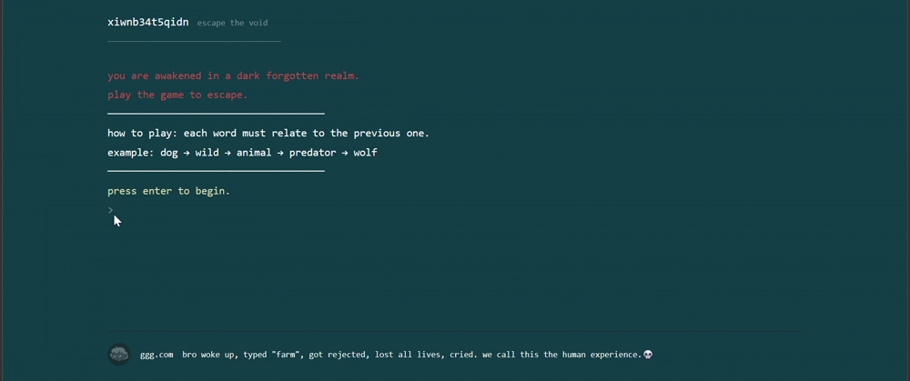

# semantic-escape-game


A semantic word chain game powered by transformer embeddings. bridge two words using meaning — not spelling, not rhyme, pure semantic similarity.



**live demo → [play it here](https://glassz13-sematic-game.hf.space)**

---

## the idea

Most word games judge you on vocabulary or spelling. this one judges you on meaning. every word you type is encoded into a 384 dimensional vector by a transformer model and scored against the previous word using cosine similarity. too weak a connection and you lose a life. the model decides everything — no hardcoded word lists, no dictionary lookups.

---

## gameplay

You are given a start word and a target word. bridge them — each step must connect to the last.
```
dog → wild → animal → predator → wolf
```

Five realms. increasing difficulty. optional riddles between realms for bonus lives. one mandatory riddle at the final gate. lose all lives and the void consumes you.

| realm | threshold | bridges |
|-------|-----------|---------|
| the wild dominion | 0.35 | 3 |
| the mortal sphere | 0.38 | 3 |
| the living world | 0.40 | 3 |
| the human paradox | 0.43 | 4 |
| the eternal gate | 0.46 | 4 |

---

## under the hood

The core mechanic runs on `sentence-transformers/all-MiniLM-L6-v2`. each word submission triggers real time inference — the word is embedded and its cosine similarity to the previous word is computed instantly.
```python
sim(current_word, new_word) >= threshold  # accepted or rejected
```

cosine similarity measures the angle between two vectors in high dimensional space. semantically similar words point in the same direction. a threshold of 0.35 means vectors must be within roughly 70 degrees of each other to pass.

`all-MiniLM-L6-v2` was chosen for its balance of speed and accuracy — small enough to run on a free tier container without a GPU, accurate enough for single word semantic scoring. embeddings are cached in memory so repeated words skip inference entirely.

---

## tech stack

| component | technology |
|-----------|------------|
| semantic scoring | `sentence-transformers` all-MiniLM-L6-v2 |
| similarity metric | cosine similarity |
| backend | FastAPI + in memory session management |
| frontend | vanilla JS terminal UI |
| deployment | Docker on HuggingFace Spaces |

---

## run locally
```bash
pip install -r requirements.txt
uvicorn main:app --reload
```

open `http://localhost:8000`

---

## project structure
```
semantic-escape-game/
├── main.py            # fastapi server + session management
├── game_engine.py     # transformer inference + game logic
├── static/
│   └── index.html     # terminal ui
├── requirements.txt
└── Dockerfile
```

---

## what i learned

building this showed how transformer embeddings actually represent meaning in practice — not just in theory. the hardest part was calibrating thresholds. too strict and the game feels unfair, too loose and any word passes. cosine similarity scores are unintuitive until you spend time mapping which words the model considers close and which it doesn't.

---


*the void remembers every word you never said.*
